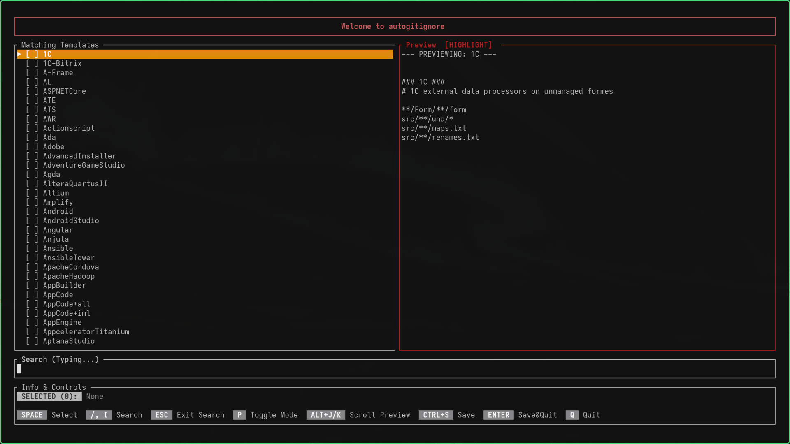

# autogitignore

Search, preview, and generate `.gitignore` files from gitignore.io (Toptal) with a fast, focused TUI.



## Highlights

- Fuzzy search across templates
- Highlighted or combined preview modes
- Multi-template selection
- Offline cache after first sync
- Safe write with `.gitignore.bak` backup
- Optional output directory support

## Quick Start

Run in the current folder:

```bash
autogitignore
```

Write into a different folder:

```bash
autogitignore --dir /path/to/project
```

Run from source:

```bash
cargo run -- --dir /path/to/project
```

## Install (One-Time)

```bash
cargo install autogitignore
```

Then:

```bash
autogitignore
```

This installs the binary from crates.io once. After that, you can run `autogitignore` anywhere.

## Configuration

CLI options:

- `-d`, `--dir <path>`: Write the `.gitignore` file into a specific directory (defaults to the current working directory).

Cache behavior:

- Templates are cached locally after the first sync.
- The cache location is determined by your OS using the `directories` crate (app cache directory).

## Controls

| Key | Action |
| --- | --- |
| `i` or `/` | Enter search mode |
| `Esc` | Exit search or close modal |
| `Space` | Toggle selection |
| `P` | Toggle preview mode (Highlighted/Combined) |
| `Alt+J` / `Alt+K` | Scroll preview |
| `Ctrl+S` | Save |
| `Enter` | Save and quit |
| `Q` | Quit |

## Project Layout

- `src/api.rs` API client and cache
- `src/app.rs` App state and business logic
- `src/ui.rs` Ratatui rendering
- `src/gitignore.rs` File writing logic
- `src/main.rs` Event loop and input handling

## Notes

- The cache is stored using `directories` in the user cache directory.
- Linux builds using `native-tls` may require OpenSSL.

## License

MIT
